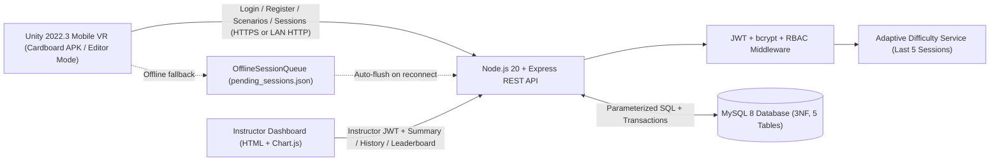
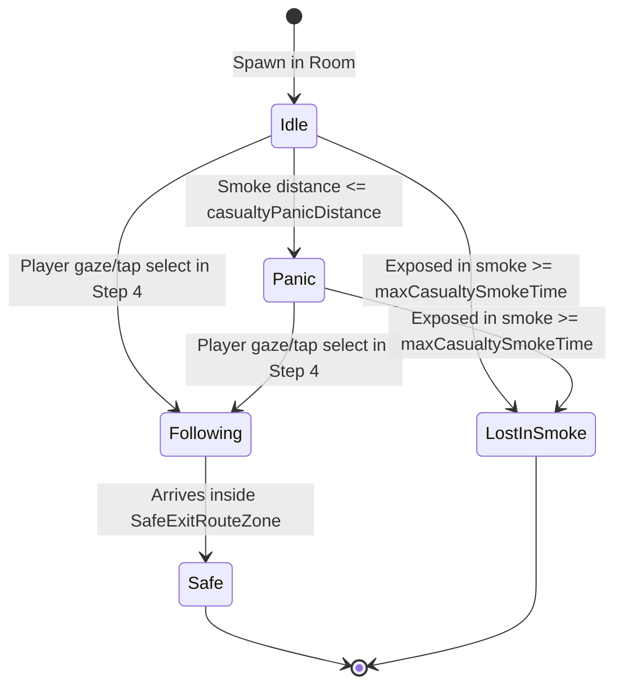
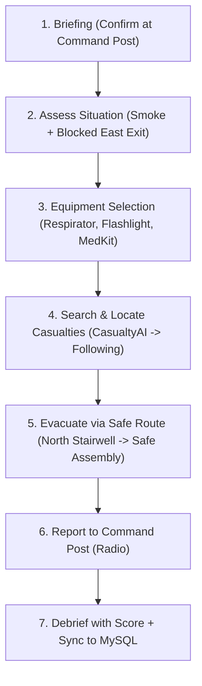

# DrillVR System & AI Architecture Diagrams

## 1. End-to-End System Architecture

```mermaid
flowchart LR
    VR["Unity 2022.3 Mobile VR (Cardboard APK / Editor Mode)"]
    Q["OfflineSessionQueue (pending_sessions.json)"]
    API["Node.js 20 + Express REST API"]
    AUTH["JWT + bcrypt + RBAC Middleware"]
    DIFF["Adaptive Difficulty Service (Last 5 Sessions)"]
    DB[("MySQL 8 Database (3NF, 5 Tables)")]
    DASH["Instructor Dashboard (HTML + Chart.js)"]

    VR -->|"Login / Register / Scenarios / Sessions (HTTPS or LAN HTTP)"| API
    VR -.->|"Offline fallback"| Q
    Q -.->|"Auto-flush on reconnect"| API
    API --> AUTH
    AUTH --> DIFF
    API <-->|"Parameterized SQL + Transactions"| DB
    DASH -->|"Instructor JWT + Summary / History / Leaderboard"| API
```

## 2. CasualtyAI State Machine

```mermaid
stateDiagram-v2
    [*] --> Idle: Spawn in Room
    Idle --> Panic: Smoke distance <= casualtyPanicDistance
    Idle --> Following: Player gaze/tap select in Step 4
    Panic --> Following: Player gaze/tap select in Step 4
    Following --> Safe: Arrives inside SafeExitRouteZone
    Idle --> LostInSmoke: Exposed in smoke >= maxCasualtySmokeTime
    Panic --> LostInSmoke: Exposed in smoke >= maxCasualtySmokeTime
    Safe --> [*]
    LostInSmoke --> [*]
```

## 3. Core 7-Step Building Emergency Drill Flow

```mermaid
flowchart TD
    S1["1. Briefing (Confirm at Command Post)"] --> S2["2. Assess Situation (Smoke + Blocked East Exit)"]
    S2 --> S3["3. Equipment Selection (Respirator, Flashlight, MedKit)"]
    S3 --> S4["4. Search & Locate Casualties (CasualtyAI -> Following)"]
    S4 --> S5["5. Evacuate via Safe Route (North Stairwell -> Safe Assembly)"]
    S5 --> S6["6. Report to Command Post (Radio)"]
    S6 --> S7["7. Debrief with Score + Sync to MySQL"]
```
